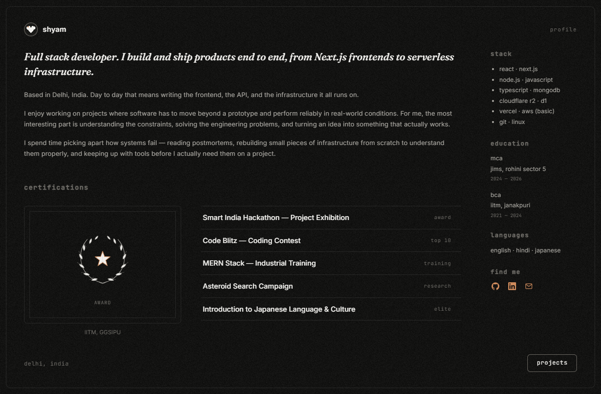

<div align="center">

# Portfolio — Shyam Singh Negi

**Full stack developer. I build and ship products end to end, from Next.js frontends to serverless infrastructure.**

[](https://shyamsingh-negi.in)
[](https://linkedin.com/in/shyam-singhnegi)
[](mailto:shyamsinghnegi54@gmail.com)

<br/>


</div>

---

<div align="center">



</div>

## Overview

A personal portfolio built with **Next.js** and deployed on **Azure Static Web Apps**, with a serverless backend for a visitor counter and a live *Now Playing* widget backed by a small bridge service.

> Originally built on AWS, later migrated to Azure. The full migration story and the things that broke along the way are at the bottom.

---

## Features

<table>
<tr>
<td width="50%" valign="top">

### Flip-card project showcase
Projects render as flip cards rather than a scrolling list — the front stays scannable (name, stack, status), the reverse carries the architecture notes.

</td>
<td width="50%" valign="top">

### Now Playing widget
A small bridge service polls the music provider's API and exposes a single endpoint to the frontend, keeping provider credentials off the client entirely.

</td>
</tr>
<tr>
<td width="50%" valign="top">

### Serverless visitor counter
An Azure Function (Python) increments and returns a view count stored in Cosmos DB. Nothing to keep running; the free tier covers the traffic.

</td>
<td width="50%" valign="top">

### Built for discovery
Canonical URL, Open Graph tags, and Twitter card metadata configured so shared links render as previews instead of bare text.

</td>
</tr>
</table>

---

## Architecture

```
                    ┌──────────────────────────────┐
   visitor  ───────▶│  Azure Static Web Apps       │
                    │  Next.js frontend            │
                    └───────┬──────────────┬───────┘
                            │              │
                  view count│              │now playing
                            ▼              ▼
                 ┌────────────────┐  ┌──────────────────┐
                 │ Azure Function │  │ bridge service   │
                 │   (Python)     │  │ (holds the keys) │
                 └───────┬────────┘  └────────┬─────────┘
                         ▼                    ▼
                 ┌────────────────┐   ┌──────────────────┐
                 │  Cosmos DB     │   │  music provider  │
                 └────────────────┘   └──────────────────┘
```

Neither the visitor counter nor the Now Playing widget exposes a credential to the browser — both sit behind a function the frontend calls by URL.

---

## Repository structure

```
├── .github/workflows/          # CI/CD — build and deploy to Azure
├── portfolio/                  # Next.js application (the live site)
├── nowplaying-bridge/          # Bridge service for the Now Playing widget
├── backend/
│   └── azure-function-code/    # Visitor counter (Azure Function, Python)
│       ├── visitorCounter/
│       ├── host.json
│       └── requirements.txt
└── README.md
```

---

## Running locally

```bash
git clone https://github.com/shyamsinghnegi/Cloud-Portfolio.git
cd Cloud-Portfolio/portfolio

npm install
npm run dev          # → http://localhost:3000
```

<details>
<summary><b>Environment variables</b> (optional — the site renders without them)</summary>

<br/>

| Variable | Used by | Purpose |
|---|---|---|
| `COSMOS_ENDPOINT` | Azure Function | Cosmos DB account URI |
| `COSMOS_KEY` | Azure Function | Cosmos DB primary key |
| `NEXT_PUBLIC_API_URL` | Frontend | Visitor counter endpoint |

Without these, the site still builds and renders — only the visitor counter and Now Playing widget go quiet.

</details>

---

## Deployment

Pushes to `main` trigger a GitHub Actions workflow that builds the Next.js app and deploys it to Azure Static Web Apps. The Azure Function deploys separately from `backend/azure-function-code/`.

---

<details>
<summary><h2 style="display:inline">History — AWS to Azure</h2></summary>

<br/>

The first version of this project ran entirely on AWS and was migrated to Azure after account and billing issues. The service mapping:

| Function | AWS (original) | Azure (current) |
|---|---|---|
| Frontend host | S3 static hosting | Azure Static Web Apps |
| Backend logic | Lambda (Python) | Azure Functions (Python) |
| API endpoint | API Gateway | Function HTTP trigger |
| Database | DynamoDB | Cosmos DB |
| IaC | AWS SAM | VS Code Azure Tools |

### Things that broke, and why

**MIME types through CloudFront.** JavaScript files were served as `text/html` instead of `text/javascript`, so the browser refused to execute them. Fixed with a CloudFront Response Headers Policy that explicitly overrode `Content-Type` — a reminder that a CDN sits between your files and the user, and can change what they claim to be.

**Storage account version.** Azure's static website hosting only exists on `General-purpose v2` accounts. The option simply wasn't in the menu until the account was upgraded.

**An API key headed for a public repo.** The Azure Function URL embeds its key as a `code` query parameter, which would have been committed inside `script.js`. Solved by gitignoring the live file and committing a `script.js.template`; the current build handles it through environment variables instead.

</details>

---

<div align="center">

**Shyam Singh Negi**

[Portfolio](https://shyamsingh-negi.in) · [GitHub](https://github.com/shyamsinghnegi) · [LinkedIn](https://linkedin.com/in/shyam-singhnegi) · [Email](mailto:shyamsinghnegi54@gmail.com)

</div>